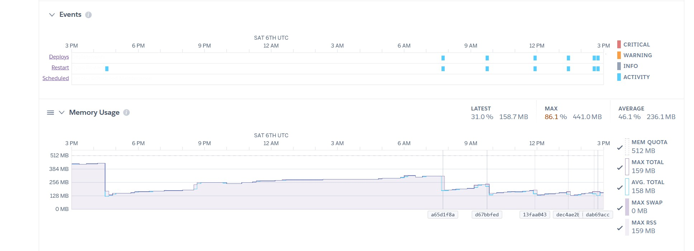

# Memory Usage Fixes

A chronological log of the work done to diagnose and fix the bot's runaway
memory usage, starting **May 30th, 2026**. The bot runs on a 512 MB dyno
(`MEM QUOTA 512 MB` in every chart), so any climb toward ~500 MB risks an
`R14 — Memory quota exceeded` event and a forced restart.

The screenshots below are the actual platform "Memory Usage" metrics captured
during the investigation, ordered by the date each one was taken. They tell the
story: early spikes that hit the 512 MB ceiling, a sawtooth leak that grew until
a restart, and finally a flat, stable footprint well under quota.

---

## Timeline at a glance

| Date | Commit | Change |
|------|--------|--------|
| 2026-05-30 | `4bb7d2f`, `a828225` | Use `Input.fromLocalFile` instead of `fs.createReadStream` for Telegram media |
| 2026-05-31 | `e83e216` | Fix canvas/buffer leaks, optimize `sharp`, clean up temp files |
| 2026-06-01 | `3119ee2` | Download custom-command images to local files (avoid discord.js buffering); extract `memoryLoger` |
| 2026-06-03 | `1800f33`, `3ddeb12`, `98651f9` | Remove deck image caching; add `heapTotal`; log memory per command |
| 2026-06-06 | `13faa04` | Null out `files`/`answer` and delete temp files after sending |
| 2026-06-11 | `73cbf0e` | Add Redis cache expiration (TTL) settings for every cache key |
| 2026-06-15 | `1ee07b4`, `ea6cc7b` | Add system monitor (in-app metrics + memory sampling) |
| 2026-06-17 | `16f3f6b` | Refactor monitoring; add memory-available settings + 24h RSS peak |
| 2026-06-18 | `211c6c2` | Cache versioning |
| 2026-06-19 | `8f9406f` | Fix RSS peak storage/display |

---

## 1. Telegram media: stop streaming file descriptors (2026-05-30)

**Commits:** `4bb7d2f`, `a828225` — *"fix: use fromLocalFile to avoid memory leaks"*

`getMediaGroup()` in `src/clients/telegram.js` opened a `fs.createReadStream`
for every attachment and tried to clean it up with `once('close')` /
`once('error')` handlers. In practice these streams (and their file
descriptors) were not reliably released, leaking memory and FDs on every
multi-card answer.

The fix hands the file path straight to Telegraf and lets the library manage
the read:

```js
// before
const stream = fs.createReadStream(value.attachment)
stream.once('close', () => stream.destroy())
stream.once('error', (err) => { console.error('Telegram Stream error:', err); stream.destroy() })
mediaGroup.push({ type: 'photo', media: { source: stream }, caption: ... })

// after
mediaGroup.push({ type: 'photo', media: Input.fromLocalFile(value.attachment), caption: ... })
```

---

## 2. Canvas, buffers and sharp (2026-05-31)

**Commit:** `e83e216` — *"fix: memory leaks and optimize sharp"*
(`canvasManager.js`, `telegramHandler.js`, `imageUpload.js`)

Three sources of growth were addressed:

**`canvasManager.js` — `drawBattlefield()`**
- Wrapped the whole render in `try/finally` so the canvas and buffer are always
  released, even on error.
- Explicitly zero the canvas (`canvas.width = 0; canvas.height = 0`) and null
  the buffer in `finally`, then call `global.gc()` when exposed
  (`node --expose-gc`).
- Switched `fs.writeFileSync` → `await fs.promises.writeFile` to stop blocking
  the event loop.

**`imageUpload.js` — sharp tuning + buffer hygiene**
```js
// Configure sharp to use less memory
sharp.cache({ memory: 50 }) // Limit cache to 50MB
sharp.concurrency(1)        // Process one image at a time to reduce memory spikes
```
- Replaced synchronous `fs.readFileSync` with `await fs.promises.readFile`.
- Released the `imageBuffer` and the base64 string (`base64Image = null`,
  `postData.image = null`) immediately after use instead of holding them until
  GC.
- `convertImageToWEBP` now destroys the probing sharp instance before the
  conversion, adds `avif` to the convertible formats, and writes webp at
  `{ quality: 85 }`.

**`telegramHandler.js` — guaranteed temp-file cleanup**
- The search handler now tracks `downloadedFiles` / `convertedFiles` arrays and
  unlinks all of them in a `finally` block, so failed conversions no longer
  leave files on disk.

### First captures of the problem (2026-06-04)

The early metrics still showed a steep climb during active hours that ran right
into the 512 MB quota — **MAX 99.6 % / 509.8 MB**, essentially touching the
ceiling before dropping back on restart.


---

## 3. Custom-command images via local files + memory logger (2026-06-01)

**Commit:** `3119ee2` — *"fix: use local files for custom commands to avoid
memory misuse by discordJS"*

When a custom command (synonym) returned remote image URLs, discord.js fetched
and buffered each one in memory before sending. The handler now downloads each
file to disk first and sends it by path:

```js
if (m.files) {
    answer.files = []
    for (const file of m.files) {
        const path = await downloadImageAsFile(file)
        answer.files.push({ attachment: path })
    }
}
await message.channel.send(answer)
answer = null            // release the response object
logMemoryUsage()
```

Supporting changes:
- Extracted the inline memory logger from `index.js` into its own reusable
  module, **`src/tools/memoryLoger.js`**, exporting `logMemoryUsage()`
  (rss / heapUsed / external / arrayBuffers in MB).
- `downloadImageAsFile` now reuses an already-downloaded file regardless of
  language (the `language &&` guard on the existence check was dropped).

---

## 4. Remove deck image caching + per-command logging (2026-06-03)

**Commits:** `1800f33` (*"feat: remove deck caching. Debugging memory usage"*),
`3ddeb12` (*"debug: add heapTotal"*), `98651f9` (*"debug: log memory usage for
every bot command"*)

Deck screenshots were being uploaded to an external cache and stored in Redis as
JSON (`uploadForCache()` + `redis.json.set(deckKey, ...)`). This path held large
buffers and JSON blobs in memory for marginal benefit, so it was removed
entirely:
- Deleted `uploadForCache()` and all `redis.json.set`/`expire` deck-cache logic
  from `deck.js` and `telegramHandler.js`.
- `createDeckImages()` lost its `redis` / `deckKey` parameters; it now just
  sends the rendered files and calls `deleteDeckFiles()`.
- Added `heapTotal` to the memory logger and logged memory around every Discord
  command to pinpoint which commands drove the growth.

---

## 5. Free buffers after sending (2026-06-06)

**Commit:** `13faa04` — *"fix: delete files and answer from memory after
processing"* (`discordHandler.js`)

After sending search results, the handler held onto the `files` array and the
`answer` object (which now also referenced the sent attachments). They are
nulled out once no longer needed, and the attachments are only attached to the
cache entry when the result is actually cacheable:

```js
const sentMessage = await message.channel.send(answer)
if (counter <= limit) {
    answer.files = sentMessage.attachments
    await redis.json.set(cacheKey, '$', answer)
}
files = null
answer = null
```

### Effect of the buffer cleanups (2026-06-06)

The footprint settled into a **sawtooth**: a long, slow climb followed by a drop
on each deploy/restart. Peak over the window was **86.1 % / 441 MB** — better
than hitting the quota, but still trending up between restarts.


After the `13faa04` deploy the curve flattened noticeably and the latest reading
dropped to ~158 MB:



---

## 6. Redis cache expiration / TTLs (2026-06-11)

**Commit:** `73cbf0e` — *"feat: add redis cache expiration and settings for it"*

Cache keys were accumulating without bounds. Per-key TTLs were introduced via
environment variables so cached decks, searches, synonyms, users, permissions,
pagination and Telegram file-ids all expire instead of growing forever:

```ini
# CACHE EXPIRATION (in seconds)
REDIS_EXP_DECK=2592000      # 30 days
REDIS_EXP_SYNONYM=86400     # 1 day
REDIS_EXP_SEARCH=7776000    # 90 days
REDIS_EXP_USER=604800       # 7 days
REDIS_EXP_PERMISSION=3600   # 1 hour
REDIS_EXP_PAGINATION=600    # 10 minutes
REDIS_EXP_TELEGRAM=7776000  # 90 days
```

### Quota exceeded again — the leak's tail (2026-06-13)

Before the monitoring work landed, a window captured an `R14` event and
**MAX 116.7 % / 597.3 MB** — memory briefly blowing past the 512 MB quota on a
spike before the platform reaped it.


Zoomed views of those deploy-time spikes (a single render briefly touching
512 MB, then settling back to ~200 MB):


---

## 7. In-app system monitor + memory sampling (2026-06-15)

**Commits:** `1ee07b4` (*"feat: add system monitor"*),
`ea6cc7b` (*"feat: show system memory samples in human-readable format"*)

Rather than relying only on the platform dashboard, a built-in monitor was
added so memory can be tracked from inside the app:
- New **`src/tools/systemMetrics.js`** records rolling memory samples in Redis
  (`system:memory:samples`), with a configurable sample limit, interval, and a
  jump-detection threshold to flag sudden increases.
- New **`src/views/system.pug`** + **`src/js/system.js`** render a `/system`
  page with charts; `router.js` exposes the metrics endpoint.
- `memoryLoger.js` now delegates to `getCurrentMemoryUsage()` and calls
  `recordMemoryUsage()`, so every logged sample is also persisted for the
  dashboard.
- Samples are shown in human-readable MB.

New tuning knobs (`.env.example`):

```ini
MEMORY_USAGE_THRESHOLD_MB=512
MEMORY_USAGE_SAMPLE_LIMIT=60
MEMORY_USAGE_SAMPLE_INTERVAL_MINUTES=10
MEMORY_USAGE_JUMP_THRESHOLD_MB=64
```

### Bounded but still creeping (2026-06-15)

With monitoring in place, the curve no longer hit the quota, but it still crept
upward across the day from ~256 MB to **358 MB** (MAX 72.5 %) — a slow growth
worth keeping an eye on.


---

## 8. Memory-available settings + 24h RSS peak (2026-06-17 → 2026-06-19)

**Commits:** `16f3f6b` (*"refactor: system monitoring. Add memory-available
settings for Node and Redis"*), `8f9406f` (*"fix: rss peak memory display and
handling"*)

- Added explicit "available memory" settings for both Node and Redis so the
  dashboard can show usage as a percentage of real capacity:
  ```ini
  MEMORY_AVAILABLE_MB=562
  REDIS_MEMORY_AVAILABLE_MB=30
  ```
- Added a **24-hour RSS peak** tracker (`system:memory:peak24h`,
  `recordPeakMemoryUsage()`) that only overwrites the stored peak when a higher
  RSS is seen, expiring after 24h.
- `8f9406f` fixed peak storage: the peak is now stored as JSON
  (`JSON.stringify(peak)`, preserving the timestamp) instead of a bare RSS
  number, and `normalizePeakMemory()` was hardened to accept plain numbers,
  numeric strings, and objects.

**Commit `211c6c2` (2026-06-18)** — *"feat: introduce cache versioning"* added a
version prefix to cached API payloads so stale/oversized cache shapes are
invalidated cleanly on deploy.

---

## 9. Result: stable footprint (2026-06-22)

After all the above, memory holds **flat around 236 MB** with a max of only
**53.5 % / 274 MB** over the window — comfortably under the 512 MB quota, no
sawtooth, no `R14` events.


---

## Summary of techniques applied

- **Hand file paths to the client** (`Input.fromLocalFile`, `downloadImageAsFile`)
  instead of streaming/buffering through Node and discord.js.
- **Always release large objects** — null out buffers, base64 strings, `answer`
  and `files` immediately after use; never hold them until GC.
- **Guaranteed cleanup with `try/finally`** for canvases, temp files and sharp
  instances, even on the error path.
- **Tune `sharp`** — small cache, single concurrency, destroy probing instances.
- **Bound the caches** — TTLs on every Redis key + cache versioning, and removed
  the deck-image cache entirely.
- **Async I/O** — replaced `fs.*Sync` calls with `fs.promises` to avoid blocking.
- **Observe everything** — extracted `memoryLoger`, added the `/system` monitor,
  rolling samples, jump detection, and a 24h RSS peak.
</content>
</invoke>
